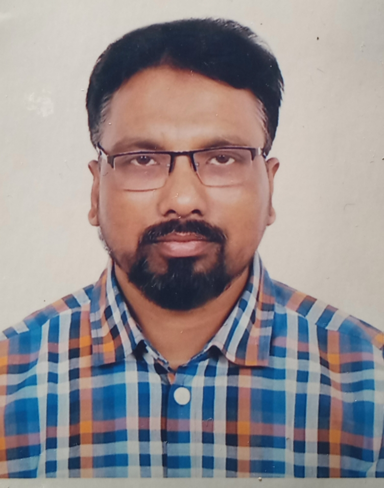

# MUHAMMAD GOLAMUN NABI NOYON

** PROFILE PICTURE **

## INTRODUCTION : 

 I am Golamun Nabi Noyon, a Bangladeshi new learner. I love to learn coding so much. But it already so much late. I have a very limited time to pratice coding although i am trying to learn something. My favorite coding  teacher Mr. Anisul Islam. 
 I have completed my graduation so much ago from National Univery. I have a job in a buying office in Dhaka. My home town is Chandpur. 

  ### EDUCATION :

  1. MA:- ISLAMIC STUDIES, 2006, GOVT BANGLA COLLEGE UNDER NATIONAL UNIVERSITY, 2ND CLASS 6TH.

  2. BA :- BACHELORE OF ARS DEGREE, 2003, FROM DHAKA COLLEGE UNDER NATIONAL UNIVERSITY. FIRST CLASS 7TH.

  3. HSC :- HSC IN SCIENCE GROUP FROM FARAZI KANDI ALIA MADRASHA, 1995, 1ST DIVISION. 
  
  4. SSC :- SSC IN SCIENCE GROUP FROM FARAZI KANDI ALIA MADRASHA, 1993, 1ST DIVISION.

  #### LANGUAGES :
  1. BANGLA : Mother language.

  2. ENGLISH : Good. 

  3. ARABIC : Basic.

  
  #### GAMES/HOBBY 
  1. Cricket
  2. Football
  3. Badminton
  4. Chess

